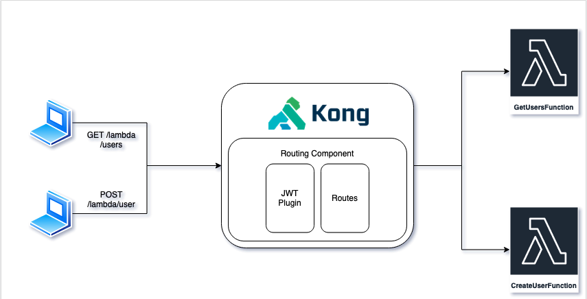

# Create API Gateway using Kong, AWS Lambda, and AWS SAM

---

In this example, We will create a simple **API Gateway** using **Kong**, authenticated using **JWT Token** and computed by **AWS Lambda**. AWS Lambda will be developed using **AWS SAM**.

---

*⚠️ Lambdas are currently not saving data to DB. This example only shows us how to integrate all the components. A fully working with DB will be added soon*

## Components explanation:
- [Kong](https://konghq.com/) is a cloud-native, platform-agnostic, scalable API Gateway distinguished for its high performance and extensibility via plugins. Build on top NGINX and Openresty.

- [AWS Lambda](https://aws.amazon.com/lambda/getting-started/) is a serverless compute service that lets you run code without provisioning or managing servers, creating workload-aware cluster scaling logic, maintaining event integrations, or managing runtimes

- [AWS SAM](https://aws.amazon.com/serverless/sam/) is an open-source framework for building serverless applications. It provides shorthand syntax to express functions, APIs, databases, and event source mappings. With just a few lines per resource, you can define the application you want and model it using YAML. During deployment, SAM transforms and expands the SAM syntax into AWS CloudFormation syntax, enabling you to build serverless applications faster.

## Architecture

## Getting Started

Please refer to ``sam/`` and ``kong/`` folders for each dedicated tutorial and explanation ``README.md``