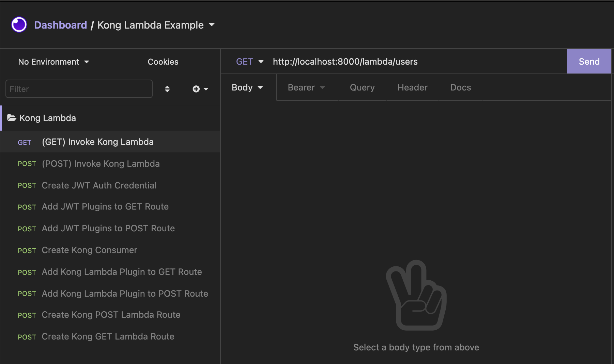
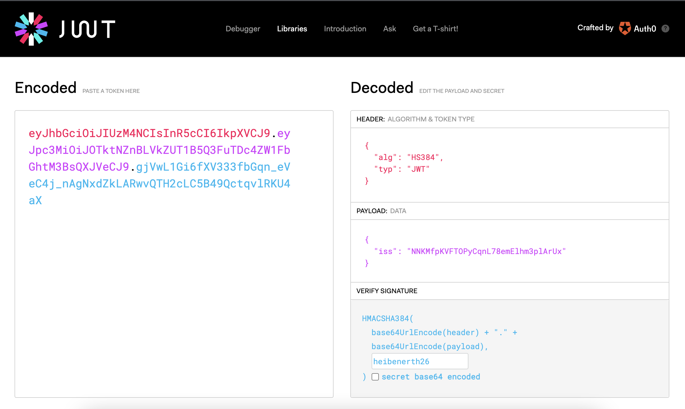

<p align="center">
  
</p>

- [Kong](https://konghq.com/) is a cloud-native, platform-agnostic, scalable API Gateway distinguished for its high performance and extensibility via plugins. Build on top NGINX and Openresty.

---

## Folder Structure
1. ``docker/`` folder contains ``docker-compose.yml`` file to provision ``kong`` and ``kong-database``

2. ``insomnia-collection/`` folder contains a list of Kong REST API Endpoints to run this example

---
## Getting Started

1. Run ``docker-compose up`` using ``docker/docker-compose.yaml`` file based on your OS architecture. This will provision a Kong PostgreSQL database only (Notice the commented Kong service section)
    ```shell
        $ docker-compose -f docker/arm64/docker-compose.yaml up -d
        # or
        $ docker-compose -f docker/x86/docker-compose.yaml up -d
    ```
2. Run the migration ``migration.sh`` which will bootstrap Kong
    ```shell
        $ chmod +x docker/arm64/migration.sh && /bin/bash docker/arm64/migration.sh
        # or
        $ chmod +x docker/x86/migration.sh && /bin/bash docker/x86/migration.sh
    ```
3. Uncomment Kong service section and re-run step 1
4. Navigate to Kong Admin API ``http://localhost:8001`` to check if Kong up and running
5. Kong is ready to use 🎉

---
## Before configuring Kong using REST APIs

1. Download [Insomnia](https://insomnia.rest/download) based on your OS
2. Import ``insomnia-collection/insomnia_kong_lambda.json`` collection into your Insomnia application
3. After importing it, it will shows us many API requests like below:
[]()

---

## Configuring Kong API Gateway using Kong REST APIs
1. Invoke ``Create Kong POST Lambda Route`` and ``Create Kong GET Lambda Route`` requests to create GET and POST routes. If successfully executed, the response will be:
    <details>
        <summary>GET Route Response</summary>
    <p>

    ```json
        {
            "methods": [
                "GET"
            ],
            "sources": null,
            "https_redirect_status_code": 426,
            "created_at": 1628339610,
            "updated_at": 1628339610,
            "name": "kong-lambda-get",
            "strip_path": true,
            "snis": null,
            "tags": null,
            "regex_priority": 0,
            "response_buffering": true,
            "path_handling": "v0",
            "hosts": null,
            "service": null,
            "id": "903d8017-50c5-4fe1-93df-287fc6e95a42",
            "headers": null,
            "preserve_host": false,
            "destinations": null,
            "request_buffering": true,
            "protocols": [
                "http",
                "https"
            ],
            "paths": [
                "/lambda/users"
            ]
        }
    ```

    </p>
    </details>
    <details>
        <summary>POST Route Response</summary>
    <p>

    ```json
        {
            "methods": [
                "POST"
            ],
            "sources": null,
            "https_redirect_status_code": 426,
            "created_at": 1628339602,
            "updated_at": 1628339602,
            "name": "kong-lambda-post",
            "strip_path": true,
            "snis": null,
            "tags": null,
            "regex_priority": 0,
            "response_buffering": true,
            "path_handling": "v0",
            "hosts": null,
            "service": null,
            "id": "8bec380f-fea6-4f27-98ce-32be0650857e",
            "headers": null,
            "preserve_host": false,
            "destinations": null,
            "request_buffering": true,
            "protocols": [
                "http",
                "https"
            ],
            "paths": [
                "/lambda/user"
            ]
        }
    ```

    </p>
    </details>

2. Next, We need to attach Kong ``aws-lambda`` plugin to each routes. Before invoking ``Add Kong Lambda Plugin to POST Route`` and ``Add Kong Lambda Plugin to GET Route``, We need to provide some AWS configurations on the headers. These are:

    - ``config.aws_key`` contains your private AWS Access Key
    - ``config.aws_secret`` contains your private AWS Secret Key
    - ``config.aws_region`` contains your preferenced AWS Region
    - ``config.function_name`` contains your full Lambda function name
    - ``config.awsgateway_compatible`` contains boolean value that says if we want to use Amazon API Gateway request event format to AWS Lambda.

3. After all of AWS configurations are set, invoke ``Add Kong Lambda Plugin to POST Route`` and ``Add Kong Lambda Plugin to GET Route``

4. Next, We need to attach ``JWT Authentication`` plugin into each routes. Remember, We want to build highly secured API Gateway. Please invoke ``Add JWT Plugins to POST Route`` and ``Add JWT Plugins to GET Route`` requests to add ``JWT Authentication`` plugin

5. Next, We need a ``Consumer`` as the individuals identity that use our services. ``Consumers`` can be attached to ``Services`` and/or ``Routes``. But, for this example, We are just using ``Routes``. Thus, please invoke ``Create Kong Consumer`` request to create Kong consumer.

6. So far, We've already created ``Routes``, attached ``Plugins`` to each ``Routes`` and created a ``Consumer`` to use our platform. You might be wonder, "🤔 Where's the JWT token, bro?". **Exactly**, We are about to create it now. So, to do that, let's take a look at ``Create JWT Auth Credential`` request. As you can see, there are configurations such as:

    - ``secret`` contains your private secret key
    - ``algorithm`` contains your chosen JWT encryption algorithm

7. After providing configurations above, let's execute the request. The request will generate a random JWT token like ``key`` below:
    <details>
        <summary> Create JWT Credential Response </summary>
    <p>

    ```json
        {
            "key": "NNKMfpKVFTOPyCqnL78emElhm3plArUx",
            "created_at": 1628341061,
            "id": "d9adea13-a490-4518-92fd-bfdd41af507b",
            "algorithm": "HS384",
            "secret": "heibenerth26",
            "tags": null,
            "rsa_public_key": null,
            "consumer": {
                "id": "a54b2546-f0e3-4440-b1dc-2afbc82ad0f0"
            }
        }
    ```

    </p>
    </details>

8. For ``Authentication Bearer`` token, We are still need to construct this ``key`` into a encoded token. Please visit https://jwt.io/ and proceed as below:
    []()
    
    - Input your JWT algorithm into the header section.
    - Input your ``key`` as ``iss`` entity on the payload section.
    - Input your ``secret`` into verify signature section
    - Your fully working JWT token is the Encoded token

## Let's test it!
1. Now, using the JWT token, please invoke ``(GET) Invoke Kong Lambda`` request. If successfully executed, it will return:
    <details>
        <summary>GET Users Response</summary>
    <p>

    ```json
        {
            "statusCode": 200,
            "data": [
                {
                    "username": "sleepycanid",
                    "gender": "male",
                    "token": "188e86f7-7e10-4abd-9f6d-489a024b9792"
                },
                {
                    "username": "excitedboar",
                    "gender": "male",
                    "token": "bc9aa2e4-a26b-486d-bce2-d54f16103bc1"
                },
                {
                    "username": "afraidgayal",
                    "gender": "male",
                    "token": "3538db78-24b0-4cb3-8ebe-d1693c1f6b1a"
                },
                {
                    "username": "medicalmagpie",
                    "gender": "male",
                    "token": "7cd10028-eb00-4a7d-a6bd-453df2cd6704"
                },
                {
                    "username": "combinedspider",
                    "gender": "male",
                    "token": "6ad0a7f3-8513-4427-9b39-3c7036d9a3b3"
                }
            ],
            "message": "success"
        }
    ```

    </p>
    </details>

2. Next, let's try the ``(POST) Invoke Kong Lambda`` request using the same JWT token. The successful response will be:
    <details>
        <summary>POST a User Response</summary>
    <p>

    ```json
        {
            "statusCode": 201,
            "data": {
                "username": "aaron",
                "token": "49d9d271-3901-4e3c-b2bb-d004f236f3cf",
                "timestamp": 1628342352781
            },
            "message": "success"
        }
    ```

    </p>
    </details>


## Congratulations, you have successfully created Kong Lambda Integration 🎉